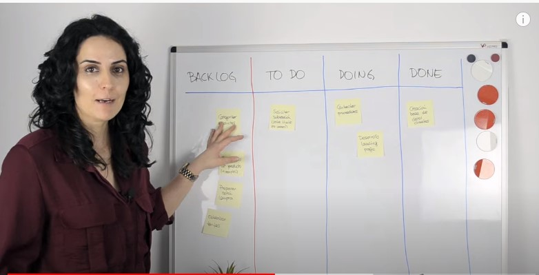

+ diagrama de gant [que es ](https://www.youtube.com/watch?v=7dXAFrxBOCY) 
+ kanban [que es ](https://www.youtube.com/watch?v=WP6Nt5XV980)  

+ [SCRUMBAN - Lo mejor de Scrum y Kanban](https://www.youtube.com/watch?v=Kxz0_rDmRho)

+ [metodologias-cris-rua](https://www.youtube.com/watch?v=v3fLx7VHxGM&list=PLotrodX72SrScd-gxE4DESavRsHkC9Wyl&index=2)

